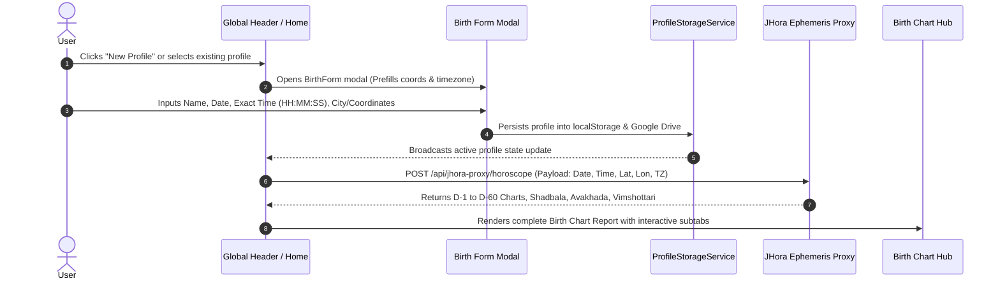
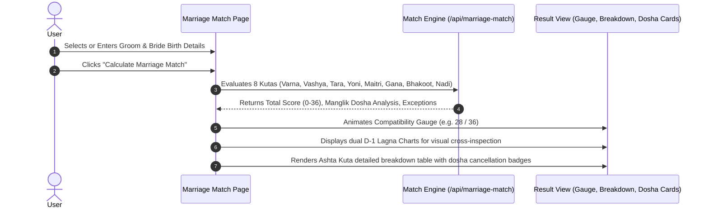
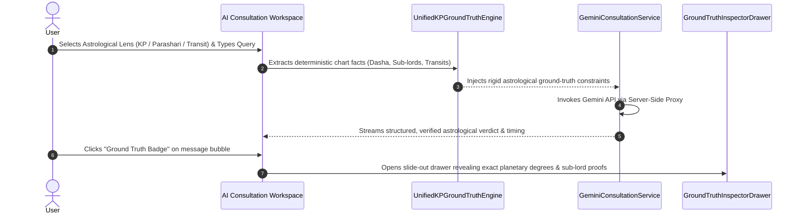
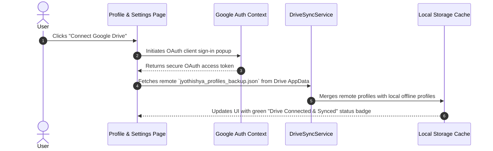

# Jyothishya Sanathanam UI & Design System Documentation

> **Application**: Jyothishya-Sanatanam V3  
> **Version**: 3.0.0-Production  
> **Platform**: Progressive Web App (React 18 + TypeScript + Vite + Tailwind CSS + Server-Side Gemini API Proxy)  
> **Domain**: Precision Vedic (Parashari), Krishnamurti Padhdhati (KP), and Modern Astrological Analytics  

---

## 1. Executive Summary & Design Philosophy

Jyothishya Sanathanam is a high-precision, scholarly Vedic and KP astrological workstation designed for astrological researchers, practitioners, and everyday users. The user interface harmonizes sacred classical aesthetic sensibilities with modern, clean, mathematical design standards.

### Core UI Principles
1. **Mathematical Precision & Optical Balance**: Strict 8px spatial grid, computed nested border radii ($R_{inner} = R_{outer} - \text{Padding}$), and WCAG AAA compliant contrast levels.
2. **Anti-Slop Craftsmanship**: No generic neon gradients, no stacked arbitrary cards, no decorative hero gimmicks. Every surface, border, and divider serves an astronomical or informational hierarchy.
3. **Dual Astrological Presentation**: Seamless toggling between South Indian (Fixed Signs) and North Indian (Fixed Houses) chart paradigms with real-time planetary glyphs and degrees.
4. **Zero-Hallucination Visual Inspection**: Ground Truth badges and inspector drawers verify all AI assertions against computed ephemeris facts directly in the UI.
5. **Multi-Script Vernacular Typography**: Balanced font pairing for English (*Playfair Display* & *Inter*), Hindi (*Noto Sans Devanagari*), and Telugu (*Noto Sans Telugu*).

---

## 2. Information Architecture & Sitemap

```mermaid
graph TD
    App[Global App Shell] --> GlobalHeader[Global Header & Profile Picker]
    App --> MainCanvas[Main Viewport Canvas]
    App --> BottomNav[Bottom Navigation Bar - 5 Hubs]
    App --> FormModal[Universal Birth Profile Modal]

    MainCanvas --> Hub1[1. Home Hub / Overview]
    MainCanvas --> Hub2[2. Birth Chart Hub]
    MainCanvas --> Hub3[3. Marriage Match Hub]
    MainCanvas --> Hub4[4. AI Consultation Hub]
    MainCanvas --> Hub5[5. Profile & Settings Hub]

    Hub1 --> H1_AI[Search-Grounded AI Hero Action]
    Hub1 --> H1_Core[Core Services Cards]
    Hub1 --> H1_Panchang[Real-Time Today Panchangam Widget]
    Hub1 --> H1_Profiles[Saved Profiles Horizontal Reel]

    Hub2 --> H2_Tabs[Birth Chart Sub-Tabs]
    H2_Tabs --> H2_T1[Overview - Lagna, Planets Table, Avakhada, Current Dasha]
    H2_Tabs --> H2_T2[Analysis - Divisional D1-D60, Shadbala, Yogas, Doshas]
    H2_Tabs --> H2_T3[KP Technical - Cusps, Sub-Lords, Significators, Ruling Planets]
    H2_Tabs --> H2_T4[Turia Report - Strategic Synthesis, Timeline, House Matrix]

    Hub3 --> H3_Input[Groom & Bride Profile Selector/Form]
    Hub3 --> H3_Gauge[Ashta Kuta Compatibility Gauge (0-36 Points)]
    Hub3 --> H3_DualCharts[Dual Lagna Chart Comparison (South/North Indian)]
    Hub3 --> H3_Breakdown[Ashta Kuta 8-Fold Scoring Matrix]
    Hub3 --> H3_Doshas[Manglik & Papasamya Dosha Cancellation Engine]

    Hub4 --> H4_Sidebar[Consultation History & Context Switcher]
    Hub4 --> H4_Chat[Multi-Lens AI Chat Stream]
    Hub4 --> H4_Inspector[Ground Truth Ephemeris Inspector Drawer]
    Hub4 --> H4_Topics[Quick Astrological Inquiry Chips]

    Hub5 --> H5_Directory[Profiles Directory & Filter/Search]
    Hub5 --> H5_Drive[Google Drive Cloud Backup & Auth Sync]
    Hub5 --> H5_Prefs[Language, Chart Style & Theme Preferences]
    Hub5 --> H5_Export[Full JSON Data Export & Privacy Controls]
```

### Complete Hierarchical Sitemap Matrix

| Hub / Route | Primary Section | Child Views & Modal Dialogs | Target Use Case |
| :--- | :--- | :--- | :--- |
| **`#home`** | **Home Hub** | • Hero AI Consultation Launcher<br>• Service Navigation Cards<br>• Real-time Panchangam Widget<br>• Profile Carousel | Rapid status check of daily Tithi/Nakshatra and direct launch into core analytical modules. |
| **`#birth-chart`** | **Overview Subtab** | • Interactive D-1 Lagna Chart<br>• Planetary Positions & Speed<br>• Avakhada Chakra Matrix<br>• Active Vimshottari Dasha Ribbon | Baseline snapshot of planetary placements, dignity, and current Mahadasha-Antardasha period. |
| | **Analysis Subtab** | • Multi-Divisional Charts (D-9, D-10, D-7, etc.)<br>• Shadbala & Bhava Bala Gauges<br>• 100+ Vedic Yogas Classifier<br>• Doshas (Manglik, Sade Sati, Kala Sarpa) | Deep-dive Parashari diagnostic analysis of planetary strengths and karmic combinations. |
| | **KP Technical Subtab** | • 12 Placidus House Cusps & Sub-Lords<br>• 4-Fold Planetary Significators Table<br>• Ruling Planets (Lagna, Moon, Day Lords)<br>• RVA Triple Chart View | High-precision timing analysis following Krishnamurti Padhdhati sub-lord doctrine. |
| | **Turia Report Subtab** | • Executive Summary & Life Themes<br>• 12 Bhavas Domain Breakdown<br>• Dasha Horizon Visual Timeline<br>• Strategic Remedies & Sanathanam Guidance | Comprehensive narrative synthesis report ready for printing, client consultation, or PDF archive. |
| **`#marriage-match`** | **Compatibility Hub** | • Groom & Bride Dual Birth Input Forms<br>• Circular 36-Point Compatibility Gauge<br>• Side-by-Side Lagna Charts (D-1)<br>• Ashta Kuta 8-Factor Breakdown Table<br>• Manglik Dosha Matching & Remedies | Full Vedic Synastry and Guna Milan evaluation with exception checks (Bhakoot/Nadi dosha cancellations). |
| **`#kundali`** | **Kundali Hub** | • Full D-1/D-9 chart visualizations<br>• Detailed planetary positions<br>• Custom report views | Comprehensive display of Kundali charts for analysis. |
| **`#panchangam`** | **Panchangam Hub** | • Daily Tithi, Nakshatra, Yoga, Karana<br>• Real-time transit data | Real-time Vedic almanac data for daily astrological planning. |
| **`#ai-consultation`**| **Advanced AI Hub** | • Multi-Turn Context-Aware Chat<br>• KP Ground Truth Engine & Ephemeris Inspector<br>• Persona Toggles (KP/Parashari)<br>• SSE Token Streaming | Intelligent astrological consultation grounded in deterministic KP/Vedic calculations. |
| **`#profile`** | **Directory & Settings**| • Saved Family & Client Profile Cards<br>• Search & Gender Filtering<br>• Google Drive Cloud Sync Toggle<br>• Chart Style (South/North) & Language Preferences<br>• Backup/Restore JSON Utility | Management of client records, offline storage, and cloud synchronization. |

---

## 3. Design System & Visual Tokens

### 3.1 Color Palette & Semantic System

The visual design is founded on the **Sacred Heritage Palette** — combining regal deep saffron, royal navy slate, warm parchment neutrals, and astrological jewel tones.

```
       LIGHT MODE SURFACE                      DARK MODE SURFACE
┌──────────────────────────────┐        ┌──────────────────────────────┐
│  --ds-surface: #FDFBF7       │        │  --ds-surface: #0F141C       │
│  --ds-surface-container:     │        │  --ds-surface-container:     │
│                #EFEEEA       │        │                #171E2B       │
│  --ds-primary: #E67E22       │        │  --ds-primary: #E89E43       │
│  --ds-secondary: #2C3E50     │        │  --ds-secondary: #8BA8CA     │
└──────────────────────────────┘        └──────────────────────────────┘
```

#### Token Definitions

| Token Identifier | Light Hex | Dark Hex | Role & Usage |
| :--- | :--- | :--- | :--- |
| `--ds-primary` | `#E67E22` (Deep Saffron) | `#E89E43` (Amber Saffron) | Primary actions, key accents, chart highlights, active tabs. |
| `--ds-on-primary` | `#FFFFFF` | `#121620` | High-contrast label on primary colored backgrounds. |
| `--ds-secondary` | `#2C3E50` (Royal Navy) | `#8BA8CA` (Slate Silver) | Headings, structural borders, secondary button outlines. |
| `--ds-tertiary` | `#D4AF37` (Vedic Gold) | `#E5C158` (Soft Gold) | Dasha timeline indicators, auspicious scores, yoga highlights. |
| `--ds-surface` | `#FDFBF7` (Parchment Cream)| `#0F141C` (Cosmic Obsidian) | Global canvas background. |
| `--ds-surface-container`| `#EFEEEA` (Sandstone) | `#171E2B` (Deep Vault) | Cards, panels, modal backdrops, table containers. |
| `--ds-on-surface` | `#1B1C1A` (Charcoal) | `#F1F5F9` (Starlight Off-White)| Primary body text and data values. |
| `--ds-on-surface-variant`| `#564337` (Earth Umber)| `#A0AEC0` (Cool Gray) | Secondary labels, descriptions, column headers. |
| `--ds-error-crimson` | `#C0392B` | `#E74C3C` | Inauspicious dosha warnings, severe planetary afflictions. |
| `--ds-success-green` | `#27AE60` | `#2ECC71` | Auspicious gunas, favorable yogas, high compatibility scores. |
| `--ds-warning-amber` | `#F39C12` | `#F1C40F` | Medium dosha influence, mixed planetary dasha periods. |

---

### 3.2 Typography Scale & Font Pairings

The typographic hierarchy uses a **Major Second (1.125) to Minor Third (1.20)** proportional scale for dense, scannable data layouts, topped by high-elegance serif display titles.

```
Title / Headings : Playfair Display (Serif, Optical Kerning, SemiBold/Bold)
Data & UI Body   : Inter / Noto Sans (Sans-Serif, 1.5–1.7 Line Height)
Degrees & Cusps  : JetBrains Mono (Monospace, Fixed Width Digits)
```

| Type Style Class | Font Family | Size / Line-Height | Weight | Tracking | Usage |
| :--- | :--- | :--- | :--- | :--- | :--- |
| `text-display-lg` | Playfair Display | 28px / 36px (1.75rem) | Bold (700) | `-0.02em` | Page-level mastheads, Hero titles |
| `text-title-lg` | Playfair Display | 20px / 28px (1.25rem) | SemiBold (600) | `-0.01em` | Card titles, Modal headers, Chart titles |
| `text-body-lg` | Inter / Sans | 16px / 24px (1.0rem) | Regular (400) | Normal | Primary reading paragraphs, Consultation bubbles |
| `text-body-md` | Inter / Sans | 14px / 20px (0.875rem)| Medium (500) | Normal | Standard UI labels, input fields, table data |
| `text-body-sm` | Inter / Sans | 12px / 16px (0.75rem) | Regular (400) | Normal | Micro-copy, timestamps, sub-lord tags |
| `text-label-caps` | Inter / Sans | 11px / 14px (0.6875rem)| Bold (700) | `+0.05em` | Table column headers, Section badges (Uppercase) |
| `text-mono-deg` | JetBrains Mono | 12px / 16px (0.75rem) | Medium (500) | `0` | Longitude degrees (e.g. `14° 22' 08"`), Rasi coordinates |

---

### 3.3 Spatial Matrix, Radii & Depth System

```
Spacing Base: 8px Incremental Scale
  --ds-space-1: 8px    --ds-space-2: 16px   --ds-space-3: 24px   --ds-space-4: 32px
  --ds-space-5: 40px   --ds-space-6: 48px   --ds-space-7: 56px   --ds-space-8: 64px

Corner Radii:
  sm: 4px   |  md: 8px   |  lg: 12px   |  xl: 16px   |  full: 9999px (Pills)

Elevation & Royal-Navy Tinted Shadows:
  --ds-shadow-sm:  0px 2px 8px  rgba(44, 62, 80, 0.06)
  --ds-shadow-md:  0px 4px 20px rgba(44, 62, 80, 0.08)
  --ds-shadow-lg:  0px 8px 32px rgba(44, 62, 80, 0.12)
```

---

## 4. Design System Component Library

### 4.1 Button Hierarchy & Specifications

```
PRIMARY BUTTON             SECONDARY OUTLINE          GHOST / TEXT
┌──────────────────────┐   ┌──────────────────────┐   ┌──────────────────────┐
│ [★] Calculate Match  │   │  [⚙] Edit Profile    │   │      View Details  › │
└──────────────────────┘   └──────────────────────┘   └──────────────────────┘
  Bg: Deep Saffron           Border: 2px Royal Navy     Bg: Transparent
  Color: Pure White          Color: Royal Navy          Color: Earth Umber
```

- **`Button`**: Supports `variant="primary" | "secondary" | "tertiary" | "ghost"`, sizes `sm` (32px), `md` (44px touch target), and `lg` (48px).
- **`ButtonGroup`**: Horizontal and vertical stacking container with seamless visual grouping and border collapsing.

---

### 4.2 Card & Surface Architecture

- **`Card`**: Standard content vessel with subtle 1px border (`border-ds-secondary/15`), soft ambient shadow, rounded corners (12px), and header dividers.
- **`SelectableCard`**: Interactive selection card with active saffron borders and checkmark states.
- **`DataCard`**: Key-value pairs display with uppercase tracking labels and high-contrast bold values.

---

### 4.3 Astrological Chart Canvas Components

#### South Indian Chart (`DivisionalChart` / `LagnaChartCard`)
- 4×4 fixed zodiac sign grid (Aries at Row 0 Col 1, Pisces at Row 0 Col 0, clockwise).
- Highlights the Ascendant (Lagna) with a dedicated badge.
- Displays retrograde planets with `(R)` indicator and combustion markers.

#### North Indian Diamond Chart (`RVANorthIndianChart`)
- Fixed 12-house diamond layout with House 1 (Ascendant) anchored at the top diamond.
- Shows zodiac sign numbers (1–12) in each triangular sector with dynamic planetary placement overlays.

---

### 4.4 Astrological Gauges & Data Tables

- **`CompatibilityGauge`**: SVG circular progress meter displaying score out of 36 points with three color-coded zones:
  - `< 18.0`: Crimson (*Afflicted / Low Compatibility*)
  - `18.0 - 24.5`: Amber (*Moderate / Average Match*)
  - `≥ 25.0`: Emerald (*Excellent / Highly Auspicious*)
- **`PlanetTable` & `CuspTable`**: Dense tabular layouts with sticky headers, planet icons, nakshatra lords, sub-lords, house associations, and dignities (*Exalted, Moolatrikona, Own Sign, Debilitated*).

---

## 5. End-to-End User Workflows

### 5.1 Workflow A: Profile Lifecycle & Kundali Generation



---

### 5.2 Workflow B: Marriage Compatibility Matching (Ashta Kuta + Doshas)



---

### 5.3 Workflow C: Ground-Truth Guided AI Consultation



---

### 5.4 Workflow D: Google Drive Cloud Sync & Persistence



---

## 6. Responsive Breakpoints & Viewport Adaptations

| Screen Size | Target Viewports | Layout Strategy |
| :--- | :--- | :--- |
| **Mobile (`< 640px`)** | iPhone 12/14/15, Pixel 7 (375px–430px) | • 1-column vertical stacking.<br>• Fixed Bottom Navigation bar (5 hubs).<br>• Slide-up sheet drawers for Panchangam & AI Inspector.<br>• Minimum 44px touch targets on all interactive controls. |
| **Tablet (`640px - 1024px`)** | iPad Mini, iPad Air, Surface Pro | • 2-column balanced grid.<br>• Side-by-side Groom & Bride cards in Marriage Match.<br>• Dual D-1 Lagna charts displayed with horizontal scroll or tabbed view. |
| **Desktop (`≥ 1024px`)** | Laptops & Widescreen Monitors (1280px–1920px) | • Max-width constrained container (`max-w-6xl` / `max-w-7xl` mx-auto).<br>• Full multi-column dashboard with persistent left sidebar in AI Consultation Hub.<br>• Side-by-side RVA Triple Chart layout (Rasi, Bhavas, Navamsha). |

---

## 7. Accessibility, Internationalization & Error Handling

### 7.1 Accessibility (a11y)
- **High Contrast Focus Rings**: All interactive buttons, tabs, and input controls carry custom `focus-ring` states with optical separation.
- **Semantic HTML**: Structural `<main>`, `<nav>`, `<header>`, `<section>`, and `<table>` elements with complete `aria-label` and `aria-expanded` attributes.
- **Color Independence**: Astrological status indicators pair color coding (green/red/amber) with explicit textual icons (`CheckCircle2`, `AlertTriangle`, `ShieldAlert`).

### 7.2 Multilingual Engine (i18n)
- **Supported Languages**: English (`en`), Hindi (`hi`), and Telugu (`te`).
- **Script Normalizer**: Automatic transliteration and rendering for Sanskrit/Vedic astrological terminology:
  - Grahas (Sun $\rightarrow$ Surya, Moon $\rightarrow$ Chandra, Jupiter $\rightarrow$ Guru)
  - Rasis (Aries $\rightarrow$ Mesha, Taurus $\rightarrow$ Vrishabha)
  - Nakshatras (Ashwini, Bharani, Krittika, etc.)

### 7.3 Error Resilience & Degradation
- **Jagannatha Hora API Fallback**: Built-in fallback calculators for Panchangam, Ashta Kuta, and KP Cusps in case of server timeouts or offline conditions.
- **Graceful Reconnection**: Clear banner alerts with single-click retry triggers when network requests fail.

---

## 8. Summary Checklist for Developers & Designers

- [x] **Universal 8px Spacing**: All containers, margins, and gaps adhere to `--ds-space-*`.
- [x] **Dual Chart Support**: All horoscope features offer South Indian and North Indian chart modes.
- [x] **Theme Consistency**: All surfaces use semantic tokens (`--ds-surface`, `--ds-primary`, `--ds-secondary`).
- [x] **WCAG AA Compliance**: 4.5:1 text-to-background contrast verified across light and dark palettes.
- [x] **Ground Truth Verification**: AI messages link directly to verifiable ephemeris inspector drawers.
